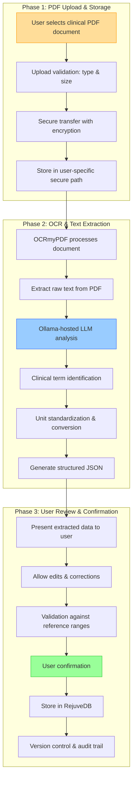
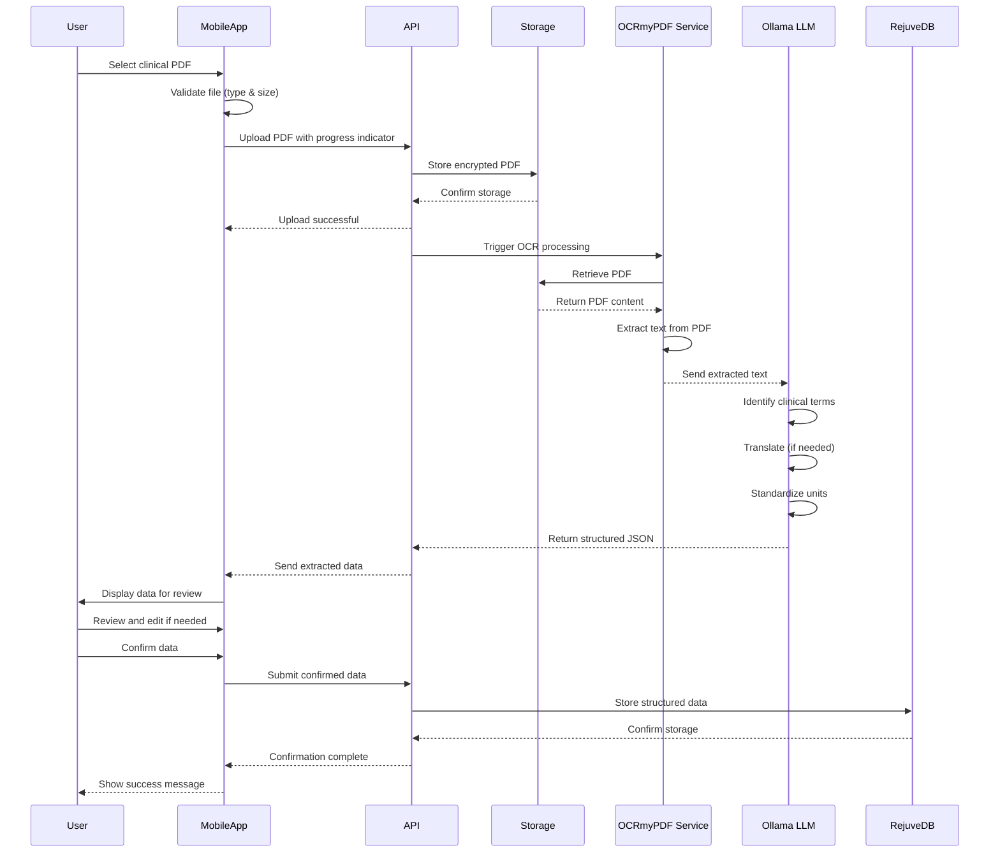

### Epic: **User Experience Enhancements — PDF Data Ingestion**

---

#### Story Title

**Enable PDF Clinical Data Ingestion into Longevity App**

*Version: 0.1 | Date: 2025-06-07 | Created by: Persival Ballesté*

---

#### Story Overview

As a **global user** of the Longevity App,  
I **want to upload a PDF file with my clinical data into the APP and see the data in the UI**,  
so that I can store all my clinical data into the APP quickly and don't need to manually type all the data.

---

#### Functional Scope

| Phase                             | Capability                                                                                                                                                                                                       | Summary                                                   |
| --------------------------------- | ---------------------------------------------------------------------------------------------------------------------------------------------------------------------------------------------------------------- | --------------------------------------------------------- |
| **1. PDF Upload & Storage**       | • Add **file upload** UI component to clinical data section. • Create secure storage for PDFs in **`user/{id}/clinical-docs/`** path. • Implement progress indicators and validation (file type, max size 10MB). | Enables users to securely submit their clinical documents |
| **2. OCR & Text Extraction**      | • Implement OCRmyPDF service to convert image-based PDFs to text. • Extract structured data using an Ollama-hosted LLM. • Create mapping layer to translate extracted terms to database variables and perform unit conversions.  | Converts unstructured document data to structured format  |
| **3. User Review & Confirmation** | • Present extracted data to user in editable format. • Allow users to correct/confirm extracted values before saving. • Store both raw PDF and structured data with versioning.                                  | Ensures data accuracy with human verification             |

#### Process Flow Visualization

**Chart Explanation:**

This workflow illustrates the three key phases of clinical data ingestion:

1. **Upload Phase**: The user selects and uploads their clinical PDF document, which undergoes validation before secure storage.

2. **Extraction Phase**: OCRmyPDF processes the document to extract raw text, which is then analyzed by the Ollama-hosted LLM. The LLM identifies clinical terms, standardizes units, and generates structured JSON output.

3. **Review Phase**: The extracted data is presented to the user for review and possible correction. After validation and confirmation, the data is stored in RejuveDB with proper versioning and audit trail.

#### System Sequence Diagram

**Sequence Diagram Explanation:**

This sequence diagram illustrates the temporal flow and interactions between system components:

1. **User Interaction**: The process begins with the user selecting and uploading a clinical PDF document through the mobile app interface.

2. **Processing Pipeline**: After validation and secure storage, the document flows through the OCRmyPDF service for text extraction, then to the Ollama LLM for intelligent analysis.

3. **Data Review**: The extracted clinical data is presented back to the user for review and confirmation before final storage in RejuveDB.

4. **Service Communication**: The diagram highlights how different services communicate with each other, showing the complete data flow from upload to final storage.

---

#### Acceptance Criteria

1. **PDF Upload**
    - Given a user with clinical data PDF, when they access the upload section, they can select and upload a PDF up to 10MB in size.
        
2. **Extraction Accuracy**
    - System correctly extracts at least 90% of standard lab values (glucose, cholesterol, etc.) from commonly formatted lab PDFs.
        
3. **Data Validation**
    - Extracted values are validated against expected ranges and units, with flagging of potential errors.
        
4. **User Review Flow**
    - After upload, user is presented with extracted data for review, can edit incorrect values, and must confirm before data is saved to their profile.
        
5. **Performance**
    - PDF processing completes in ≤ 15 seconds for standard 5-page documents, with progress indicators shown to user.
        
---

#### Implementation Tasks (high-level)

- **Front-End (Flutter)**
    - Create PDF upload component with progress indicator.
    - Develop data review/edit interface with confirmation flow.
    - Implement unit display based on user preferences.
        
- **Back-End / API**
    - Create `/upload-clinical-pdf` endpoint with S3 presigned URLs.
    - Develop extraction service with OCRmyPDF and Ollama LLM pipeline.
    - Build mapping service to convert extracted terms to database fields.
    - Implement lambda service to process JSON output for RejuveDB storage.
        
- **Database & Storage**
    - Table: `user_clinical_docs` (user_id, doc_id, upload_date, status, file_path).
    - Table: `extracted_clinical_data` (doc_id, variable_name, value, unit, confidence, reviewed).
    - Add versioning for data corrections and historical records.
        
- **Machine Learning & LLM Integration**
    - Configure Ollama-based LLM for clinical document interpretation.
    - Implement text processing for multiple languages and unit conversions.
    - Train the LLM to output structured JSON for database ingestion.
    - Create feedback loop for extraction improvements.
        
- **DevOps**
    - Set up secure S3 bucket with appropriate access policies.
    - Configure extraction service scaling based on queue depth.
    - Monitor processing times and extraction accuracy metrics.
        

---

#### Dependencies & Risks

|Item|Impact|Mitigation|
|---|---|---|
|Variable quality of PDF documents|High|Implement image preprocessing and provide guidance on scan quality|
|Diverse clinical lab formats|High|Train on diverse document corpus and implement format detection|
|PHI/HIPAA compliance|Critical|Process all documents in HIPAA-compliant environment with encryption|
|Performance at scale|Medium|Implement queue system with auto-scaling extraction workers|

---

#### Non-Functional Requirements

- **Security**: All PDFs must be encrypted at rest and in transit; processing must occur in HIPAA-compliant environment.
- **Scalability**: System should handle concurrent uploads during peak periods with minimal latency increase.
- **Accessibility**: Provide alternative manual data entry for users who cannot upload PDFs.
- **Privacy**: Implement document retention policies and user-controlled data deletion.

---

#### Definition of Done

- All acceptance criteria met on staging environment and validated with test PDFs from different labs.
- Processing accuracy metrics reach ≥90% for common labs, ≥75% for specialized tests.
- Regression tests ensure upload and extraction flows remain functional across app updates.
- User testing confirms intuitive navigation through upload → review → confirmation flow.
- Feature flag toggled **ON** in production after processing 1000+ documents with ≥85% user satisfaction.