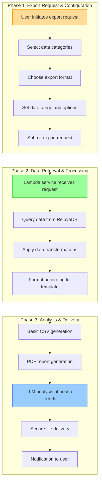
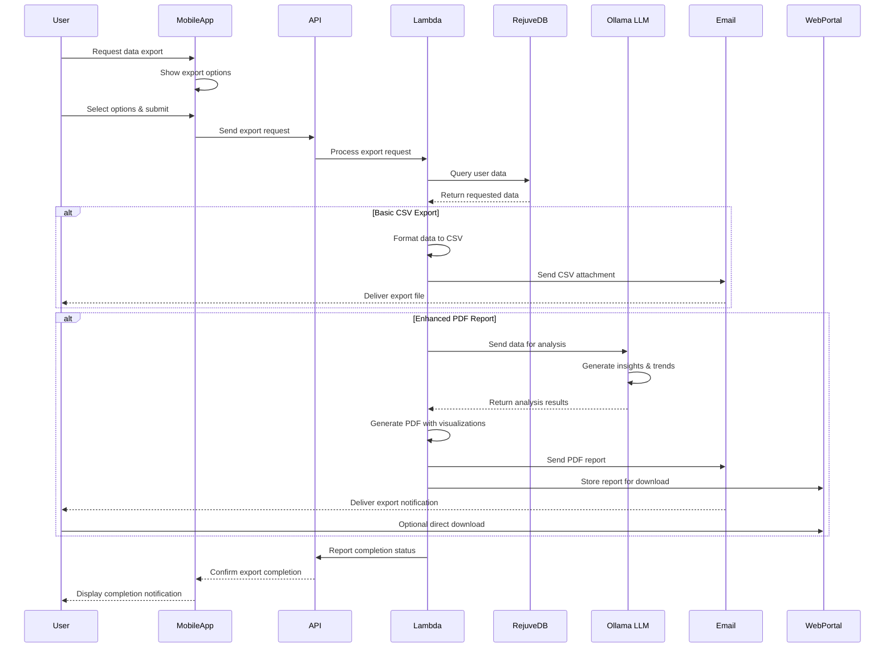

### Epic: **User Experience Enhancements — Export Data**

---

#### Story Title

**Enable Data Export for User Health Information**

*Version: 0.2 | Date: 2025-06-09 | Created by: Persival Ballesté*

---

#### Story Overview

As a **Longevity App user**,  
I **want to export my health data in various formats (.csv, PDF) from the app**,  
so that I can share my information with healthcare providers, import it into other health systems, and maintain personal records of my health journey.

---

#### Implementation Alternatives

| Approach | Description | Pros | Cons | Timeline |
| --- | --- | --- | --- | --- |
| **Alternative 1: Basic CSV Export** | Simple data export to CSV files delivered via email with minimal formatting | • Quick implementation (2-3 weeks) • Universal compatibility • Easy to import into other systems • Low computational requirements • Minimal frontend changes | • Limited visual appeal • No data insights or analysis • Requires user to manage files • May be challenging to interpret | ?weeks |
| **Alternative 2: Enhanced PDF Reports** | Comprehensive PDF reports with data visualizations, LLM-generated insights, and analysis of health trends | • Professional presentation • Valuable health insights from LLM • Visualization of trends and correlations • Better for sharing with healthcare providers • Higher user perceived value | • Longer development time (4-6 weeks) • More complex processing • Higher computational requirements • More difficult to import data | ?weeks |

**Recommended Approach:** Implement both alternatives in phases - begin with Alternative 1 (Basic CSV Export) for immediate functionality, followed by Alternative 2 (Enhanced PDF Reports) for added value. This phased approach allows users to export data immediately while we develop the more sophisticated reporting capabilities.

>> We'll implement the basic CSV export first with email delivery to minimize frontend changes, while simultaneously developing the more sophisticated PDF reporting feature that leverages our Ollama LLM for data analysis and insights.

---

#### Functional Scope

|Phase|Capability|Summary|
|---|---|---|
|**1. Export Request & Configuration**|• Create **export request UI** in app settings. • Implement data selection options for export scope. • Design email delivery system for export files.|Allows users to request and configure data exports|
|**2. Data Retrieval & Processing**|• Develop Lambda service to query RejuveDB for selected data. • Implement data formatting for CSV and PDF outputs. • Create data anonymization options for sharing.|Extracts and prepares data in appropriate formats|
|**3. Enhanced Analysis & Delivery**|• Integrate Ollama-hosted LLM for health data insights. • Develop PDF templates with data visualizations. • Implement secure file delivery via email and direct download.|Provides valuable context and secure access to exports|

---

#### Acceptance Criteria

1. **Export Configuration**
   - Users can select specific data categories to include in exports (e.g., lab results, food logs, activity data).
   - Date range selection allows filtering of data by timeframe.
   - Export format options include CSV (immediate) and PDF (enhanced reports).
   - Users can choose delivery method (email and/or web portal access).

2. **CSV Export Quality**
   - CSV files include clear column headers with units where applicable.
   - Data is properly formatted with consistent date/time representations.
   - All exported data accurately matches values in the app.
   - CSV files can be successfully imported into common spreadsheet applications.
   - Files include metadata (export date, version, user information).

3. **PDF Report Quality**
   - PDF reports include professional styling with Rejuve branding.
   - Data is visualized with appropriate charts and graphs.
   - LLM-generated insights highlight notable trends and correlations.
   - Medical terminology includes clear explanations for non-medical users.
   - Reports are printer-friendly and maintain formatting when printed.

4. **Delivery & Security**
   - Exported data is delivered via secure channels (encrypted email and/or secure portal).
   - Users receive clear notification when exports are complete and available.
   - Personal information is handled according to privacy policies and regulations.
   - Optional anonymization for exports intended for research or sharing.
   - Clear audit trail of all export activities.

5. **Clinician Integration**
   - Exported data formats align with common clinical systems' import requirements.
   - PDF reports include sections specifically formatted for healthcare provider review.
   - CSV exports include standardized codes (where applicable) for clinical data interoperability.

---

#### Implementation Tasks (high-level)

- **Front-End (Flutter)**
    - Create export configuration interface in app settings.
    - Implement data category selection UI with clear grouping and descriptions.
    - Design date range selector for filtering export data.
    - Develop export format selection interface with preview examples.
    - Build export status and history section for tracking previous exports.

- **Back-End / API**
    - Develop `/export/request` endpoint to handle export configuration.
    - Create Lambda service for data retrieval and processing.
    - Implement CSV generation service with configurable templates.
    - Build PDF report generation pipeline with visualization capabilities.
    - Create secure file storage system for exports with temporary access links.

- **Ollama LLM Integration**
    - Configure Ollama-hosted LLM for health data analysis and insight generation.
    - Develop specialized prompts for identifying notable trends and correlations.
    - Create templates for converting LLM outputs into structured report sections.
    - Implement feedback loop for improving insight quality over time.

- **Data & Security**
    - Design database queries for efficient data retrieval across multiple tables.
    - Implement data transformation pipeline for consistent formatting.
    - Create anonymization service for removing/obscuring personal identifiers.
    - Develop secure email delivery system with encryption.
    - Build audit logging system for all export activities.

- **Testing & Validation**
    - Create test suite for verifying data accuracy in exports.
    - Validate CSV imports in common third-party systems.
    - Test PDF rendering across devices and print environments.
    - Verify security measures for data protection during export process.

---

#### Dependencies & Risks

| Item | Impact | Mitigation |
| ----------------------------- | -------- | ------------------------------------------------------------------------------ |
| Data volume performance | Medium | Implement pagination and background processing for large exports |
| Email delivery reliability | High | Add redundant delivery methods and status tracking with retry logic |
| LLM insight quality | Medium | Establish clear guidelines for insights with human review for quality assurance |
| Clinical system compatibility | High | Research and test with common clinical data formats; provide import instructions |
| Privacy regulations compliance | Critical | Regular legal review of export processes and strict data handling protocols |

---

#### Non-Functional Requirements

- **Performance**: Export requests must begin processing within 30 seconds of submission; CSV exports completed within 5 minutes; PDF reports within 15 minutes (for standard data volumes).

- **Security**: All exported data must be encrypted both in transit and at rest; access links must expire after 7 days.

- **Reliability**: Export system must maintain 99.5% success rate; failed exports must automatically retry up to 3 times.

- **Scalability**: System must handle concurrent export requests from up to 10% of user base without degradation.

- **Compatibility**: CSV exports must be compatible with Excel, Google Sheets, and common clinical data systems; PDFs must be viewable on all standard PDF readers.

- **Privacy**: Export process must comply with GDPR, HIPAA, and other relevant data protection regulations in user's jurisdiction.

---

#### Definition of Done

- CSV and PDF export options function correctly across all supported devices.

- Export data accurately reflects the user's health information in the app.

- PDFs include properly rendered visualizations and meaningful LLM-generated insights.

- Delivery mechanisms (email and web portal) reliably provide exports to users.

- Export process handles all edge cases (large data volumes, special characters, etc.).

- Security review confirms proper protection of sensitive data throughout the export process.

- Clinical validation confirms compatibility with standard medical systems and workflows.

---

#### Use of Reusable Services

This story leverages several reusable services and components that are shared across multiple features in Epic 1, promoting code reuse and architectural consistency:

1. **Ollama-hosted LLM Service**
   - Analyzing health data to identify trends and correlations
   - Generating natural language insights for PDF reports
   - Contextualizing medical terminology for better user understanding
   - Creating data summaries that highlight key information
   - Maintaining consistency with health domain knowledge used in other features

2. **Lambda Data Processing Service**
   - Standardized data retrieval from RejuveDB with consistent query patterns
   - Common transformation pipeline for data formatting
   - Reusable templates for CSV and PDF generation
   - Shared anonymization capabilities for privacy protection
   - Audit logging for compliance and tracking

3. **RejuveDB Integration**
   - Consistent access patterns for retrieving user health data
   - Standardized schema for exporting structured information
   - Historical data access with consistent versioning
   - User preference storage for export configurations
   - Export history tracking and management

4. **Secure File Delivery System**
   - Common infrastructure for temporary file storage
   - Standardized email delivery with encryption
   - Secure web portal access with authentication
   - Consistent expiration and cleanup processes
   - Reusable notification system for user alerts

---

#### Process Flow Visualization

**Chart Explanation:**

This workflow illustrates the three key phases of the data export process:

1. **Export Request Phase**: The user initiates an export through the app interface, selecting the desired data categories, format (CSV or PDF), date range, and additional options before submitting the request.

2. **Data Processing Phase**: The Lambda service receives the request, queries RejuveDB for the specified data, applies necessary transformations (such as formatting and anonymization if selected), and prepares it according to the selected template.

3. **Analysis & Delivery Phase**: For basic exports, CSV files are generated immediately. For enhanced exports, PDF reports are created with visualizations, and the Ollama-hosted LLM analyzes the data for insights and trends. Files are then securely delivered via email and/or made available for direct download, with a notification sent to the user.

#### System Sequence Diagram

**Sequence Diagram Explanation:**

This sequence diagram illustrates the interactions between system components during the data export process:

1. **Request Initiation**: The user requests a data export through the mobile app interface, selecting their preferred options for data scope, format, and delivery method.

2. **Data Acquisition**: The export request is sent to the API and processed by the Lambda service, which queries RejuveDB for the requested data based on the user's selections.

3. **Format-Specific Processing**:
   - For basic CSV exports, the Lambda service formats the data and sends it directly as an email attachment to the user.
   - For enhanced PDF reports, the data is sent to the Ollama-hosted LLM for analysis and insights, which are incorporated into a visually appealing PDF report with data visualizations.

4. **Delivery Options**: The export is delivered to the user via email and/or made available for direct download through a secure web portal, with appropriate notifications sent to the user.
