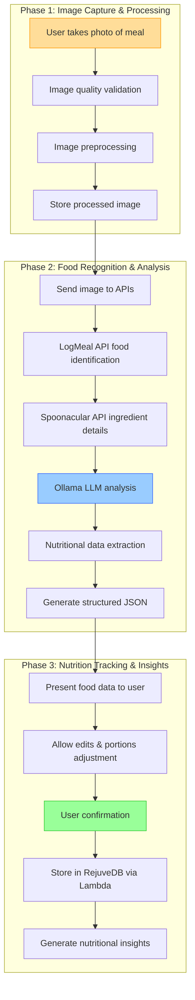
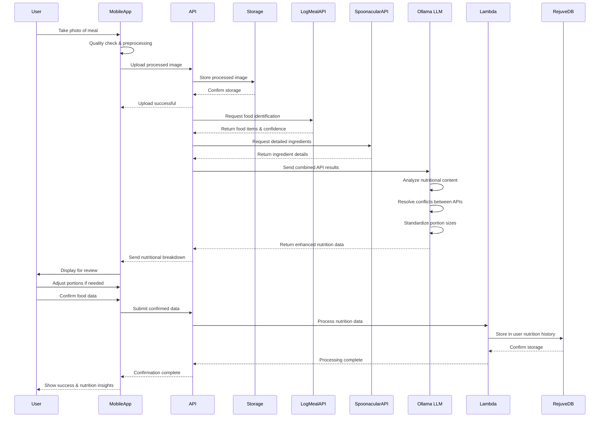

### Epic: **User Experience Enhancements — Meal and Ingredient using Computer Vision**

---

#### Story Title

**Enable Meal and Ingredient Identification Using Computer Vision**

*Version: 0.2 | Date: 2025-06-09 | Created by: Persival Ballesté*

---

#### Story Overview

As a **health-conscious user** of the Longevity App,  
I **want to take photos of my meals and have the app identify the food and ingredients automatically**,  
so that I can easily track my nutrition without manually searching and logging each component of my meals.

---

#### Functional Scope

| Phase                             | Capability                                                                                                                                                                                                       | Summary                                                   |
| --------------------------------- | ---------------------------------------------------------------------------------------------------------------------------------------------------------------------------------------------------------------- | --------------------------------------------------------- |
| **1. Image Capture & Processing** | • Add **camera integration** to nutrition tracking section. • Create image preprocessing pipeline for optimal analysis. • Implement real-time quality feedback to ensure usable images. | Enables users to easily capture high-quality food images for analysis |
| **2. Food Recognition & Analysis** | • Integrate hybrid API approach (LogMeal + Spoonacular) for food recognition. • Use Ollama-hosted LLM to enhance ingredient identification and nutritional analysis. • Create feedback mechanism for improving recognition accuracy. | Transforms food images into detailed nutritional data |
| **3. Nutrition Tracking & Insights** | • Present nutritional breakdown with editable values. • Integrate identified foods into user's nutrition history via Lambda service to RejuveDB. • Generate insights based on nutritional patterns and health goals. | Connects visual food recognition to personalized health tracking |

---

#### Acceptance Criteria

1. **Image Capture Quality**
    - App provides real-time guidance for optimal food image capture (lighting, angle, distance).
    - Users can review captured image before submitting for analysis.
        
2. **Recognition Accuracy**
    - System correctly identifies main food items in ≥85% of properly captured images.
    - Ingredient breakdown has ≥70% accuracy for common foods.
    - When confidence is low, system presents multiple possible matches for user selection.
        
3. **Nutritional Analysis**
    - Identified foods are automatically mapped to nutritional database values.
    - For each food item, system displays calories, macronutrients, and relevant micronutrients.
    - Users can adjust portion sizes and modify/add/remove ingredients as needed.
        
4. **Performance**
    - Image analysis completes in ≤5 seconds on standard network connection.
    - Local caching reduces repeated API calls for common foods.
        
5. **History & Insights**
    - Computer vision identified meals are stored with a visual thumbnail in user's nutrition history.
    - Visual vs. manual entries are distinguished in nutrition reports.

---

#### Implementation Tasks (high-level)

- **Front-End (Flutter)**
    
    - Develop camera integration with real-time guidance.
        
    - Create meal review/edit interface with nutritional breakdown visualization.
        
    - Implement food history display with image thumbnails.
        
- **Back-End / API**
    
    - Create `/analyze-food-image` endpoint with multi-API orchestration.
        
    - Develop caching layer to store common food recognition results.
        
    - Build nutritional database mapping service.
        
- **Machine Learning**
    
    - Implement image preprocessing for optimal API input.
        
    - Create confidence scoring system for recognition results.
        
    - Develop food categorization taxonomy mapping.
        
- **Database & Storage**
    
    - Table: `user_food_images` (user_id, image_id, timestamp, storage_path).
        
    - Table: `recognition_results` (image_id, food_items, confidence_scores, nutrition_data).
        
    - Secure cloud storage with appropriate retention policies.
        
- **DevOps**
    
    - Configure API quotas and rate limiting.
        
    - Implement monitoring for API costs and usage patterns.
        
    - Set up logging for recognition accuracy analytics.
        

---

#### Dependencies & Risks

|Item|Impact|Mitigation|
|---|---|---|
|API recognition limitations|High|Supplement with user feedback and continuous improvement|
|Variable lighting conditions|Medium|Implement image preprocessing and user guidance|
|API costs scaling with usage|Medium|Implement effective caching and optimize API calls|
|Privacy concerns with food images|Medium|Clear retention policies and user-controlled deletion|

---

#### Non-Functional Requirements

- **Security**: Food images must be stored securely with user-controlled access and retention.
    
- **Privacy**: Clear consent for cloud processing of images with transparent data usage terms.
    
- **Scalability**: System designed to handle peak meal-time traffic patterns without degradation.
    
- **Offline Capability**: Basic camera functionality works offline, queuing analysis for when connectivity returns.
    
- **Accessibility**: Alternative manual food entry available for all users.

---

#### Definition of Done

- All acceptance criteria met in staging environment using diverse test meal images.
- Recognition accuracy metrics reach targets across different food categories and lighting conditions.
- User testing confirms intuitive flow from image capture to nutritional insights.
- Performance metrics meet or exceed targets on different mobile devices and network conditions.
- Feature flag toggled **ON** in production after successful pilot with ≥90% user satisfaction.

---

#### Use of Reusable Services

This story leverages several reusable services and components that are shared across multiple features in Epic 1, promoting code reuse and architectural consistency:

1. **Secure Image Storage Service**
   - Common infrastructure for storing user-generated content (PDFs in Story 1, food images in Story 3)
   - User-scoped paths with appropriate access controls
   - Encryption at rest and in transit
   - Configurable retention policies
   - Standardized metadata handling

2. **Ollama-hosted LLM Service**
   - Shared LLM instance used across multiple features
   - Contextual processing of extracted data (clinical values in Story 1, nutritional information in Story 3)
   - Multi-lingual translation capabilities
   - Unit standardization and conversion
   - Structured JSON output generation for downstream systems
   - Confidence scoring for extracted values

3. **Lambda Data Processing Service**
   - Common middleware between data extraction and RejuveDB
   - Standardized JSON schema validation
   - Data transformation and normalization
   - Error handling and logging
   - Audit trail creation
   - Role-based access control

4. **RejuveDB Integration**
   - Common database tables for user data history
   - Versioning support for data corrections
   - Query optimization for health analytics
   - Data relationship mapping
   - Backup and recovery procedures

---

#### Process Flow Visualization

**Chart Explanation:**

This workflow illustrates the three key phases of meal and ingredient identification:

1. **Image Capture Phase**: The user takes a photo of their meal, which undergoes quality validation and preprocessing before secure storage.

2. **Recognition Phase**: The image is processed through multiple APIs (LogMeal and Spoonacular) and enhanced by the Ollama-hosted LLM, which identifies ingredients, analyzes nutritional content, and generates structured data.

3. **Tracking Phase**: The extracted nutritional data is presented to the user for review and confirmation before being stored in RejuveDB via a Lambda service for long-term tracking and insights.

#### System Sequence Diagram

**Sequence Diagram Explanation:**

This sequence diagram illustrates the temporal flow and interactions between system components:

1. **Image Capture**: The process begins with the user taking a photo of their meal, which is validated and preprocessed locally before upload.

2. **Multi-API Processing**: The image is analyzed using a hybrid approach combining LogMeal and Spoonacular APIs for comprehensive food identification.

3. **LLM Enhancement**: The Ollama-hosted LLM analyzes the combined API results to resolve conflicts, standardize portion sizes, and enhance the nutritional data.

4. **User Confirmation**: The processed nutritional data is presented to the user for review and adjustment before confirmation.

5. **Data Storage**: The confirmed data is processed by a Lambda service and stored in RejuveDB for user's nutrition history and insights.

