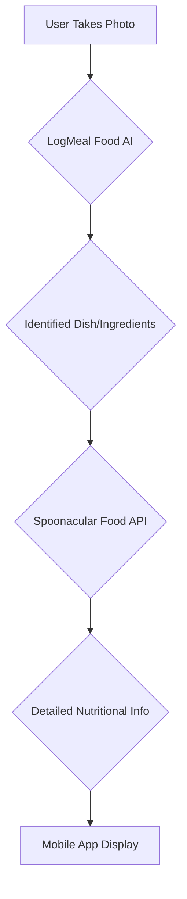

# Research on Computer Vision APIs for Meal and Ingredient Identification

## Executive Summary

This report presents an in-depth research on services and APIs with AI computer vision capabilities for identifying meals and their ingredients from mobile phone pictures. The main objective is to provide a detailed analysis of the available options in the market, focusing on the granularity of ingredient identification for health science purposes.

Our primary recommendation is a hybrid approach combining LogMeal Food AI for food recognition with Spoonacular Food API for detailed nutritional information. This combination offers the best balance between accuracy in ingredient identification and cost-effectiveness, with an estimated implementation time of 10-17 days and initial operational costs of approximately $259-$339 per month.

**View the interactive report website:** [AI Computer Vision APIs for Meal Identification](https://qnfeahmr.manus.space)

## Table of Contents

1. [Introduction](#introduction)
2. [Methodology](#methodology)
3. [Analysis of Services and APIs](#analysis-of-services-and-apis)
   - [Google Cloud Vision AI](#google-cloud-vision-ai)
   - [Calorie Mama AI](#calorie-mama-ai)
   - [LogMeal Food AI](#logmeal-food-ai)
   - [Spoonacular Food API](#spoonacular-food-api)
4. [Detailed Comparison](#detailed-comparison)
5. [Integration with Flutter and Python](#integration-with-flutter-and-python)
6. [Code Examples](#code-examples)
   - [LogMeal Food AI Integration](#logmeal-food-ai-integration)
   - [Calorie Mama AI Integration](#calorie-mama-ai-integration)
   - [Hybrid Approach](#hybrid-approach)
7. [Final Recommendations](#final-recommendations)
   - [Recommended Solution](#recommended-solution)
   - [Time Estimation](#time-estimation)
   - [Cost Analysis](#cost-analysis)
   - [Additional Considerations](#additional-considerations)
8. [Conclusion](#conclusion)
9. [References](#references)

## Introduction

Accurate identification of foods and their ingredients from images represents a significant challenge at the intersection of computer vision, artificial intelligence, and health science. Applications in this area have the potential to revolutionize nutritional monitoring, assist in diet management, identify allergens, and support public health research.

This report investigates the main solutions available in the market that allow the identification of meals and the granular analysis of their ingredients from photographs taken by mobile devices. The focus is on APIs and services that can be integrated into mobile applications developed with Flutter and Python backends.

The main objectives of this research are:

1. Identify and analyze the most suitable APIs for food and ingredient recognition
2. Compare features, limitations, costs, and ease of integration
3. Provide practical code examples for implementation
4. Recommend the best solution considering accuracy, cost, and implementation time

## Methodology

The research was conducted through a combination of:

1. **Documentary analysis:** Review of official documentation, terms of service, and pricing guides for each API
2. **Market research:** Investigation of available solutions and their characteristics
3. **Technical analysis:** Evaluation of technical capabilities, integration methods, and implementation requirements
4. **Comparative analysis:** Systematic comparison between different solutions based on predefined criteria

The evaluation criteria included:
- Specialization in food recognition
- Granularity in ingredient identification
- Availability of nutritional information
- Ease of integration with Flutter and Python
- Cost structure and scalability
- Quality of documentation and support

## Analysis of Services and APIs

### Google Cloud Vision AI

Google Cloud Vision AI is a general-purpose computer vision API that offers various image analysis features, including label detection, text detection, facial detection, and image properties.

**Key Features:**
- Label Detection
- Text Detection
- Document Text Detection
- Safe Search
- Facial Detection
- Celebrity Recognition
- Landmark Detection
- Logo Detection
- Image Properties

**Ingredient Granularity:**
Google Cloud Vision AI is not specialized in food or ingredient recognition. While it can detect food as a general category through label detection, it does not offer sufficient granularity to identify specific ingredients in a meal. Significant additional processing and possibly custom model training would be required to extract detailed nutritional information.

**Costs:**
- The first 1,000 units/month are free for most features.
- From 1,001 units/month, the cost varies by feature and usage volume:
  - Label Detection: $1.50 per 1,000 units (up to 5 million/month), $1.00 per 1,000 units (above 5 million/month)
  - Text Detection: $1.50 per 1,000 units (up to 5 million/month), $0.60 per 1,000 units (above 5 million/month)

**Integration:**
Integration is done via REST or RPC API. Google provides client libraries for various languages, including Python, facilitating backend implementation. For the Flutter frontend, images would need to be sent to the backend, which would then make the API calls.

**Evaluation:**
Although Google Cloud Vision AI is a robust and well-documented general computer vision solution, it is not the most suitable for the specific case of granular ingredient identification in meals. It would be more appropriate as a complementary component in a more comprehensive solution.

### Calorie Mama AI

Calorie Mama AI is an API specialized in food recognition and nutritional analysis from images. Developed by Azumio, it is specifically designed to identify foods and provide nutritional estimates.

**Key Features:**
- Food recognition from images
- Estimation of calories and macronutrients (carbohydrates, fats, proteins)
- Complete nutritional information
- Recognition of over 100,000 foods, beverages, and packaged products

**Ingredient Granularity:**
Calorie Mama AI offers high granularity in identifying foods and their nutritional components. It is capable of recognizing complex dishes and restaurant foods, providing detailed information about their nutritional content. This makes it well-suited for health applications that require detailed ingredient analysis.

**Costs:**
- **Test Plan:** $100/month for 1,000 server calls
- **20k Plan:** $2,000/month for 20,000 server calls
- **Custom Plan:** Price on request for a custom number of calls

**Integration:**
Integration is done via REST API. Registration on the developer portal is required to obtain an API key and authenticate calls. The documentation is clear, and the authentication process follows common standards, facilitating implementation in both Python backend and Flutter frontend.

**Evaluation:**
Calorie Mama AI is a robust and specialized solution for food recognition and nutritional analysis. Its high granularity in ingredient identification makes it an excellent option for health applications. However, its cost can be a limiting factor for applications with high user or analysis volumes.

### LogMeal Food AI

LogMeal Food AI is an API specialized in food recognition, developed by AIGecko Technologies. It uses advanced deep learning techniques to identify dishes, ingredients, and provide nutritional information.

**Key Features:**
- Detection of over 1,300 different dishes
- Detailed nutritional analysis
- Identification of food groups, dishes, ingredients, and recipes
- Recognition of multiple foods in a single image

**Ingredient Granularity:**
LogMeal Food AI offers high granularity in identifying meal components. Its specialization in food recognition allows for detailed analysis of ingredients present in a dish, making it suitable for applications that require precise nutritional information.

**Costs:**
- **Free Trial Period:** 30 days or 200 queries and 5 registered users
- **Analyze Plan:** 144€/month (22,000 monthly credits included), 0.01€ per extra credit
- **Monitor Plan:** 316€/month (22,000 monthly credits included), 0.01€ per extra credit
- **Recommend Plan:** 488€/month (26,400 monthly credits included), 0.03€ per extra credit
- **Custom Plan:** On request

**Integration:**
Integration is done via REST API. The documentation provides detailed information about available endpoints and request/response formats. The API is specifically designed for food recognition, which simplifies implementation for this specific use case.

**Evaluation:**
LogMeal Food AI is a specialized and effective solution for food recognition and nutritional analysis. Its ability to identify over 1,300 different dishes and provide detailed nutritional information makes it an excellent option for health applications. The free trial period allows evaluating the API's accuracy before committing to a paid plan.

### Spoonacular Food API

Spoonacular Food API is a comprehensive API focused on food, recipe, and nutrition data. Although its primary focus is not image recognition, it offers a vast database of foods and detailed nutritional information.

**Key Features:**
- Extensive food and recipe database
- Detailed nutritional analysis
- Recipe search by ingredients
- Information on allergens and specific diets
- Food recognition (limited functionality)

**Ingredient Granularity:**
For visual recognition, Spoonacular's granularity is medium to low. However, once the food is identified (by another API or by text input), Spoonacular offers extremely detailed information about ingredients, nutrients, allergens, and dietary compatibility.

**Costs:**
- **Free Plan:** 150 points/day, 1 request/second, forum support, mandatory backlink
- **Cook Plan:** $29/month, 1,500 points/day (then $0.005/point), 5 requests/second, email support
- **Culinarian Plan:** $79/month, 4,500 points/day (then $0.004/point), 10 requests/second, email support
- **Chef Plan:** $149/month, 10,000 points/day (then $0.002/point), 20 requests/second, phone support, exclusive previews
- **Enterprise Plan:** From $300/month, customized for specific needs

**Integration:**
Integration is done via REST API, with clear and comprehensive documentation. The API offers various endpoints for different food and nutrition-related functionalities, allowing flexible implementation adaptable to different needs.

**Evaluation:**
Spoonacular Food API is best suited as a complement to a visual food recognition API. Its extensive food database and detailed nutritional information make it valuable for enriching data obtained through visual recognition. The point-based pricing structure offers flexibility for different usage volumes.

## Detailed Comparison

The table below presents a detailed comparison of the four analyzed APIs, considering various criteria relevant for implementing a meal and ingredient identification system:

| Criterion | Google Cloud Vision AI | Calorie Mama AI | LogMeal Food AI | Spoonacular Food API |
|----------|------------------------|-----------------|-----------------|----------------------|
| **Food Specialization** | Low (general-purpose API) | High | High | Medium (recipe-focused) |
| **Ingredient Granularity** | Low | High | High | Medium |
| **Nutritional Information** | No (requires additional processing) | Yes | Yes | Yes (detailed) |
| **Ease of Integration** | High | Medium-High | Medium-High | High |
| **Initial Cost** | Free up to 1,000 units/month | $100/month (1,000 calls) | Free trial (30 days/200 queries) | Free up to 150 points/day |
| **Cost for Scale** | $1.50 per 1,000 units | $2,000/month (20,000 calls) | 144€-488€/month | $29-$149/month |
| **Documentation** | Excellent | Good | Good | Excellent |
| **Support** | Extensive (Google Cloud) | Email | Email | Varies by plan |
| **Multiple Food Recognition** | Limited | Yes | Yes | N/A |
| **Accuracy in Complex Dishes** | Low | High | High | N/A |
| **Allergen Information** | No | Partial | Partial | Yes |
| **Dietary Compatibility** | No | Partial | Partial | Yes |
| **Packaged Product Analysis** | Yes (via OCR) | Yes | Limited | Yes (via barcode) |

### Strengths and Weaknesses

**Google Cloud Vision AI:**
- **Strengths:** Robust infrastructure, high availability, excellent documentation, good free tier.
- **Weaknesses:** Not specialized in food, low granularity for ingredients, requires significant additional processing.

**Calorie Mama AI:**
- **Strengths:** Specialized in food recognition, high granularity, complete nutritional information.
- **Weaknesses:** High cost for larger volumes, less comprehensive documentation than competitors.

**LogMeal Food AI:**
- **Strengths:** Specialized in food recognition, wide variety of recognized dishes, free trial period.
- **Weaknesses:** Pricing structure can be complex, less detailed documentation in some aspects.

**Spoonacular Food API:**
- **Strengths:** Extremely detailed nutritional database, allergen and diet information, affordable prices.
- **Weaknesses:** Limited visual recognition capability, primary focus on recipes rather than image analysis.

## Integration with Flutter and Python

This section details the integration process for Flutter (frontend) and Python (backend) with the discussed APIs. A typical flow involves the mobile app capturing an image, sending it to a Python backend, which then processes the image using the chosen computer vision API and returns the results to the mobile app.

```mermaid
graph TD
    A[Mobile App (Flutter)] --> B{Capture Image}
    B --> C[Send Image to Backend]
    C --> D[Python Backend (Flask/FastAPI)]
    D --> E{Call Computer Vision API}
    E --> F[Computer Vision API (e.g., LogMeal, Calorie Mama)]
    F --> G{Return Recognition Results}
    G --> D
    D --> H[Process Results]
    H --> I[Return Processed Data to Mobile App]
    I --> A
```

### Integration with Flutter (Frontend)

To integrate REST APIs into a Flutter application, the general steps are:

1.  **Add the `http` dependency:** In your Flutter project's `pubspec.yaml` file, add the `http` dependency:

    ```yaml
    dependencies:
      flutter:
        sdk: flutter
      http: ^1.2.1
    ```

    After adding, run `flutter pub get` in the terminal.

2.  **Make the HTTP request:** Use the `http` package to make GET, POST, etc. requests. To send an image, you would typically use a POST request with the request body containing the image bytes or a multipart file.

    ```dart
    import 'package:http/http.dart' as http;
    import 'dart:convert';
    import 'dart:io';

    Future<Map<String, dynamic>> uploadImageAndGetIngredients(File imageFile) async {
      final url = Uri.parse('YOUR_BACKEND_API_URL');
      var request = http.MultipartRequest('POST', url)
        ..files.add(await http.MultipartFile.fromPath('image', imageFile.path));

      var response = await request.send();

      if (response.statusCode == 200) {
        final responseBody = await response.stream.bytesToString();
        return json.decode(responseBody);
      } else {
        throw Exception('Failed to upload image: ${response.statusCode}');
      }
    }
    ```

3.  **Process the response:** The API response (usually JSON) can be decoded and used to display information in the application.

4.  **State management:** Use a state manager (Provider, BLoC, Riverpod, etc.) to manage the application's state and display API data in the user interface.

### Integration with Python (Backend)

For the Python backend, you can use a web framework like Flask or FastAPI to create an endpoint that receives the image from the Flutter application, calls the computer vision API (LogMeal, Calorie Mama, etc.), and returns the results.

#### Example with Flask:

1.  **Install Flask and requests:**

    ```bash
    pip install Flask requests
    ```

2.  **Create `app.py` file:**

    ```python
    from flask import Flask, request, jsonify
    import requests
    import base64

    app = Flask(__name__)

    @app.route('/analyze_meal', methods=['POST'])
    def analyze_meal():
        if 'image' not in request.files:
            return jsonify({'error': 'No image provided'}), 400

        image_file = request.files['image']
        if image_file.filename == '':
            return jsonify({'error': 'No image selected'}), 400

        if image_file:
            # Read the image in bytes
            image_bytes = image_file.read()

            # Example call to LogMeal API (replace with your key and endpoint)
            logmeal_api_key = 'YOUR_LOGMEAL_API_KEY'
            logmeal_endpoint = 'https://api.logmeal.es/v2/image/recognition/dish'

            headers = {
                'Authorization': f'Bearer {logmeal_api_key}',
                'Content-Type': 'application/json'
            }
            payload = {
                'image': base64.b64encode(image_bytes).decode('utf-8')
            }

            try:
                response = requests.post(logmeal_endpoint, headers=headers, json=payload)
                response.raise_for_status() # Raise an exception for HTTP errors
                logmeal_result = response.json()
                return jsonify(logmeal_result)
            except requests.exceptions.RequestException as e:
                return jsonify({'error': f'LogMeal API error: {e}'}), 500

    if __name__ == '__main__':
        app.run(debug=True, host='0.0.0.0', port=5000)
    ```

## Code Examples

For detailed code examples for integration with Flutter (frontend) and Python (backend) for each of the discussed APIs, please refer to the `exemplos_codigo_integracao.md` file:

[Code Examples for Integration](exemplos_codigo_integracao.md)

## Final Recommendations

### Recommended Solution: Hybrid Approach with LogMeal Food AI + Spoonacular

Based on the analysis performed, our primary recommendation for a meal and ingredient identification application for health purposes is a hybrid approach combining LogMeal Food AI for food recognition with Spoonacular Food API for detailed nutritional information.



### Justification

1.  **LogMeal Food AI** offers excellent image food recognition capabilities, with detection of over 1,300 different dishes. It specializes in food identification, making it ideal for the first step of the process.
2.  **Spoonacular Food API** has an extremely detailed nutritional database and offers granular information about ingredients. It can complement LogMeal by providing more complete nutritional data after the initial food identification.
3.  **Cost-effectiveness:** This combination offers a good balance between accuracy and cost. The initial LogMeal plan (144€/month) combined with the Spoonacular Cook plan ($29/month) offers a robust solution for approximately $185/month.
4.  **Scalability:** Both APIs offer scaling options as the application grows, with predictable pricing.

### Alternative Recommended: Calorie Mama AI

If the preference is for a single, simpler solution to implement, Calorie Mama AI would be the best choice. It offers good food recognition and nutritional information in a single API, albeit at a higher cost for larger volumes.

### Time Estimation

| Phase | Description | Estimated Time |
| --- | --- | --- |
| Environment Setup | Flutter project and Python backend setup | 1-2 days |
| Frontend Integration | User interface development and image capture | 3-5 days |
| Backend Integration | REST API implementation and integration with external APIs | 3-5 days |
| Testing and Optimization | Integration testing, performance optimization | 2-3 days |
| Deployment | Server configuration, CI/CD, monitoring | 1-2 days |
| Total |  | 10-17 days |

### Operational Monthly Costs

| Item | Estimated Cost |
| --- | --- |
| LogMeal Food AI (Analyze Plan) | 144€ (~$160)/month |
| Spoonacular Food API (Cook Plan) | $29/month |
| Backend Hosting (AWS/GCP) | $50-$100/month |
| Monitoring Services | $20-$50/month |
| Total Monthly Operational | $259 - $339/month |

## Conclusion

Meal and ingredient identification from images using AI computer vision represents a promising area for health and nutrition applications. The APIs analyzed in this report offer different levels of specialization, accuracy, and cost.

The recommended hybrid approach, combining LogMeal Food AI for food recognition with Spoonacular Food API for detailed nutritional information, offers the best balance between accuracy, cost, and ease of implementation. This solution allows for granular identification of ingredients in meals, providing valuable data for health science purposes.

Implementation can be achieved in a relatively short period (10-17 days) with accessible initial operational costs (approximately $259-$339 per month). As the application grows, costs will increase, but in a predictable and manageable way.

We recommend starting with a proof of concept to validate the accuracy and performance of the proposed solution, followed by real user testing before full development and launch.

## References

- [Google Cloud Vision AI](https://cloud.google.com/vision?hl=en)
- [Calorie Mama AI](https://dev.caloriemama.ai/)
- [LogMeal Food AI](https://logmeal.com/api/)
- [Spoonacular Food API](https://spoonacular.com/food-api/)


