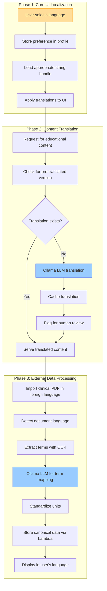
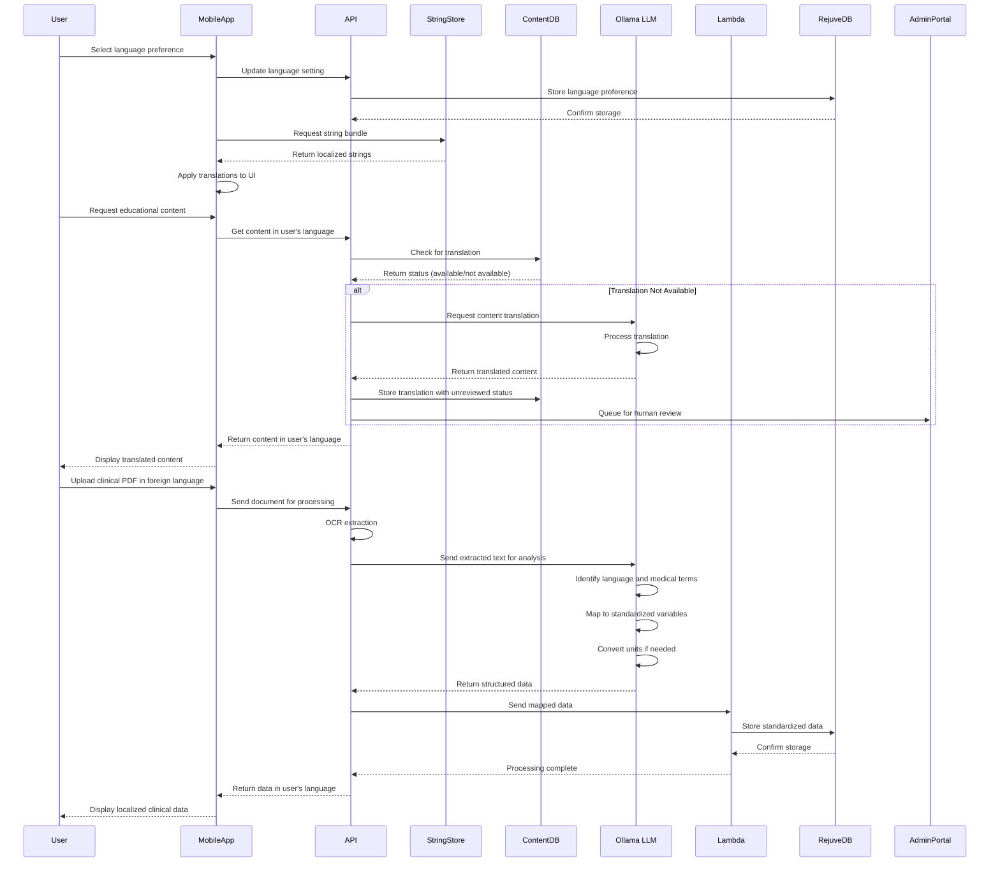

### Epic: **User Experience Enhancements — Multilanguage Support**

---

#### Story Title

**Enable Multilanguage Experience Across the Longevity App**

*Version: 0.2 | Date: 2025-06-09 | Created by: Persival Ballesté*

---

#### Story Overview

As a **global user** of the Longevity App,  
I **want to choose my preferred language during registration and use the app entirely in that language**,  
so that I can interact with all UI elements, educational papers, and imported clinical-exam data in a familiar, localized form.

---

#### Functional Scope

| Phase                                        | Capability                                                                                                                                                                                                                                                                                                                                                      | Summary                                               |
| -------------------------------------------- | --------------------------------------------------------------------------------------------------------------------------------------------------------------------------------------------------------------------------------------------------------------------------------------------------------------------------------------------------------------- | ----------------------------------------------------- |
| **1. Core UI Localisation**                  | • Add **language selector** to sign-up screen (and to profile settings for later changes). • Persist choice in **`users.language_code`** column (ISO-639-1, e.g. `"en"`, `"pt"`, `"es"`). • On app start-up, load the correct **string bundle** (key-value pairs) from a high-performance store (S3 JSON, Firebase Remote Config, or SQL table cached locally). | Enables full app localization with minimal performance impact |
| **2. Academic Paper & Hallmark Translation** | • Store translated versions of each recommended paper/hallmark summary. • Fallback path: real-time translation via Ollama-hosted LLM when translation is missing, then **asynchronously cache** result for reuse. • Add admin UI (in existing Back-Office Epic) for human review & approval of machine translations. | Provides educational content in user's preferred language |
| **3. External Data & Unit Conversion**       | • When users upload clinical-exam PDFs, detect document language and **map terms to English variable names** using the Ollama LLM. • Translate extracted terms back to the user's language for display. • Convert units (e.g., mmol/L ↔ mg/dL) based on locale; persist canonical units in the database via Lambda service. | Ensures consistent data interpretation across languages |

---

#### Acceptance Criteria

1. **Language Persistence**
    - Given a new user selects Spanish, when they log out and return, the UI loads in Spanish without extra input.
        
2. **Zero-Fallback Strings**
    - No UI string appears in English (default) if a translation exists for the chosen language; missing keys are logged for the content team.
        
3. **Paper Translation Quality Gate**
    - Translated paper snippets show “Reviewed” status before surfacing to end-users. Unreviewed content is hidden or flagged “Auto-Translated (Preview)”.
        
4. **PDF Term Mapping & Units**
    - A cholesterol result labeled “Colesterol Total” in Portuguese PDF maps to database variable `total_cholesterol` and displays to user as “Colesterol Total: 190 mg/dL”.
        
5. **Performance**
    - App start-up time impact ≤ 200 ms for string-bundle retrieval.
        

---

#### Implementation Tasks (high-level)

- **Front-End (Flutter)**
    
    - Add language selector component and persistence.
        
    - Create localization service to fetch and cache bundles.
        
    - Integrate unit-conversion helpers tied to locale.
        
- **Back-End / API**
    
    - Extend `users` table with `language_code`.
        
    - Endpoint to serve string bundles with cache headers.
        
    - Endpoint to fetch paper translations (with fallback trigger to LLM).
        
- **Database & Storage**
    
    - Table: `translations(strings)` (key, language_code, text, updated_at).
        
    - Table: `paper_translations` (paper_id, language_code, html_content, reviewed_by).
        
    - Indexes for fast lookup; consider CDN edge caching.
        
- **Admin Portal**
    
    - List pending translations, inline editor with side-by-side original.
        
    - “Mark as reviewed” flow (write audit log).
        
- **DevOps**
    
    - Feature flag for new localization pipeline.
        
    - Monitor LLM translation costs & latency.
        

---

#### Dependencies & Risks

| Item                          | Impact | Mitigation                                                        |
| ----------------------------- | ------ | ----------------------------------------------------------------- |
| Accurate medical term mapping | High   | Use existing clinical terminology library; add manual overrides.  |
| LLM translation cost spikes   | Medium | Cache aggressively; pre-translate most-viewed assets.             |
| Human-in-the-loop capacity    | Medium | Schedule weekly review slots; crowd-insource via medical interns. |

---

#### Non-Functional Requirements

- **Security**: Translations must never expose PHI; ensure PDFs are processed server-side in HIPAA-compliant environment.
    
- **Scalability**: Design bundle fetch endpoint to serve > 100 req/s with < 100 ms P95 latency.
    
- **Accessibility**: String bundles must include text direction metadata (anticipate RTL languages in future).
    

---

#### Definition of Done

- All acceptance criteria met on staging & confirmed by QA in two languages (EN, PT).
    
- Regression tests added for language switch and PDF import flow.
    
- Documentation updated (developer guide + admin guide).
    
- Feature flag toggled **ON** in production after pilot cohort feedback (≥ 95 % satisfaction).

---

#### Use of Reusable Services

This story leverages several reusable services and components that are shared across multiple features in Epic 1, promoting code reuse and architectural consistency:

1. **Ollama-hosted LLM Service**
   - Shared LLM instance used across multiple features
   - Multilingual translation of text (educational content, clinical terms)
   - Term standardization and mapping between languages
   - Unit conversion based on regional standards
   - Context-aware interpretation of foreign language medical terminology
   - Processing with appropriate language models for different languages

2. **Lambda Data Processing Service**
   - Common middleware between data extraction and RejuveDB
   - Standardized JSON schema validation across languages
   - Data transformation and normalization to canonical formats
   - Error handling and logging in multiple languages
   - Audit trail creation with language metadata

3. **RejuveDB Integration**
   - Common database tables for user language preferences
   - Storage of canonical (language-agnostic) data with localized display options
   - Versioning support for translations and corrections
   - Query optimizations for multilingual content retrieval

4. **Secure Content Storage Service**
   - Shared infrastructure for storing translations and localized content
   - Efficient caching of language bundles and educational materials
   - CDN integration for global content delivery
   - Version control for translated materials

---

#### Process Flow Visualization

**Chart Explanation:**

This workflow illustrates the three key phases of multilanguage support:

1. **UI Localization Phase**: The user selects their preferred language, which is stored in their profile and used to load the appropriate string bundle for the UI.

2. **Content Translation Phase**: When educational content is requested, the system checks for a pre-translated version. If none exists, the Ollama-hosted LLM generates a translation, which is cached and flagged for human review.

3. **External Data Processing Phase**: When clinical documents in foreign languages are imported, the system detects the language, extracts terms using OCR, and uses the Ollama LLM to map terms to standardized variables before storing the data via the Lambda service.

#### System Sequence Diagram

**Sequence Diagram Explanation:**

This sequence diagram illustrates the interaction flow for multilanguage support:

1. **Language Selection**: The user selects their preferred language, which is stored in RejuveDB and used to retrieve the appropriate string bundle for UI localization.

2. **Content Translation**: When educational content is requested, the system checks if a translation exists. If not, the Ollama LLM translates it in real-time, caches the result, and queues it for human review.

3. **Clinical Data Processing**: When a user uploads a clinical PDF in a foreign language, the system uses OCR for extraction and the Ollama LLM to identify the language, map medical terms to standardized variables, and convert units if necessary. The Lambda service then stores the standardized data in RejuveDB, and the results are displayed to the user in their preferred language.

---

#### Implementation Tasks (high-level)

- **Front-End (Flutter)**
    
    - Add language selector component and persistence.
        
    - Create localization service to fetch and cache bundles.
        
    - Integrate unit-conversion helpers tied to locale.
        
- **Back-End / API**
    
    - Extend `users` table with `language_code`.
        
    - Endpoint to serve string bundles with cache headers.
        
    - Endpoint to fetch paper translations (with fallback trigger to LLM).
        
- **Database & Storage**
    
    - Table: `translations(strings)` (key, language_code, text, updated_at).
        
    - Table: `paper_translations` (paper_id, language_code, html_content, reviewed_by).
        
    - Indexes for fast lookup; consider CDN edge caching.
        
- **Admin Portal**
    
    - List pending translations, inline editor with side-by-side original.
        
    - “Mark as reviewed” flow (write audit log).
        
- **DevOps**
    
    - Feature flag for new localization pipeline.
        
    - Monitor LLM translation costs & latency.
        

---

#### Dependencies & Risks

| Item                          | Impact | Mitigation                                                        |
| ----------------------------- | ------ | ----------------------------------------------------------------- |
| Accurate medical term mapping | High   | Use existing clinical terminology library; add manual overrides.  |
| LLM translation cost spikes   | Medium | Cache aggressively; pre-translate most-viewed assets.             |
| Human-in-the-loop capacity    | Medium | Schedule weekly review slots; crowd-insource via medical interns. |

---

#### Non-Functional Requirements

- **Security**: Translations must never expose PHI; ensure PDFs are processed server-side in HIPAA-compliant environment.
    
- **Scalability**: Design bundle fetch endpoint to serve > 100 req/s with < 100 ms P95 latency.
    
- **Accessibility**: String bundles must include text direction metadata (anticipate RTL languages in future).
    

---

#### Definition of Done

- All acceptance criteria met on staging & confirmed by QA in two languages (EN, PT).
    
- Regression tests added for language switch and PDF import flow.
    
- Documentation updated (developer guide + admin guide).
    
- Feature flag toggled **ON** in production after pilot cohort feedback (≥ 95 % satisfaction).

---

#### Use of Reusable Services

This story leverages several reusable services and components that are shared across multiple features in Epic 1, promoting code reuse and architectural consistency:

1. **Ollama-hosted LLM Service**
   - Shared LLM instance used across multiple features
   - Multilingual translation of text (educational content, clinical terms)
   - Term standardization and mapping between languages
   - Unit conversion based on regional standards
   - Context-aware interpretation of foreign language medical terminology
   - Processing with appropriate language models for different languages

2. **Lambda Data Processing Service**
   - Common middleware between data extraction and RejuveDB
   - Standardized JSON schema validation across languages
   - Data transformation and normalization to canonical formats
   - Error handling and logging in multiple languages
   - Audit trail creation with language metadata

3. **RejuveDB Integration**
   - Common database tables for user language preferences
   - Storage of canonical (language-agnostic) data with localized display options
   - Versioning support for translations and corrections
   - Query optimizations for multilingual content retrieval

4. **Secure Content Storage Service**
   - Shared infrastructure for storing translations and localized content
   - Efficient caching of language bundles and educational materials
   - CDN integration for global content delivery
   - Version control for translated materials