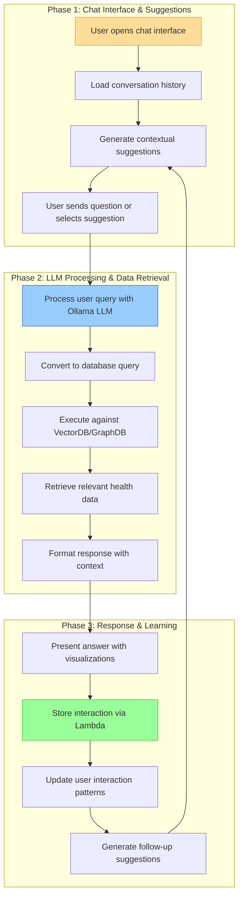
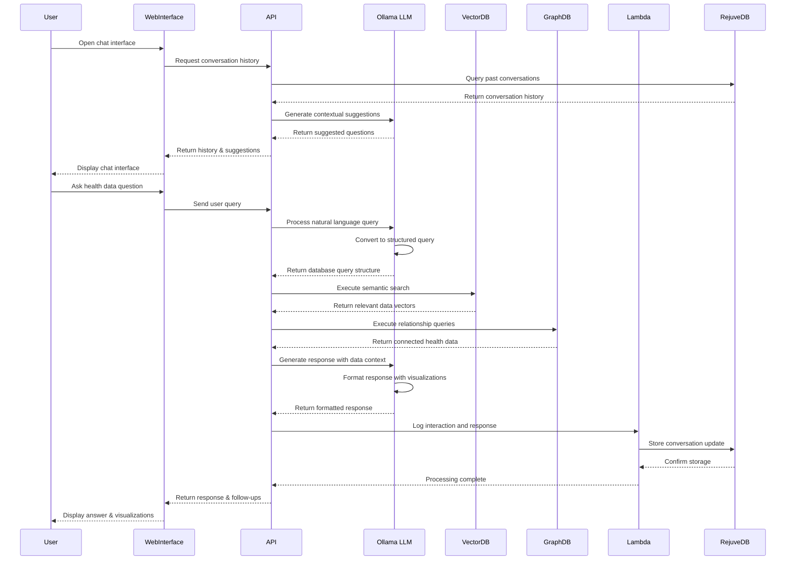

### Epic: **User Experience Enhancements — Chat with my data**

---

#### Story Title

**Enable Conversational Interface for Personal Health Data**

*Version: 0.2 | Date: 2025-06-09 | Created by: Persival Ballesté*

---

#### Story Overview

As a **Longevity App user**,  
I **want to interact with my health data through natural language conversations**,  
so that I can easily understand patterns and get insights without needing to navigate complex interfaces or understand medical terminology.

---

#### Implementation Alternatives

| Approach                                    | Description                                                                                              | Pros                                                                                                                                                                                                                     | Cons                                                                                                                                                               | Timeline |
| ------------------------------------------- | -------------------------------------------------------------------------------------------------------- | ------------------------------------------------------------------------------------------------------------------------------------------------------------------------------------------------------------------------ | ------------------------------------------------------------------------------------------------------------------------------------------------------------------ | -------- |
| **Alternative 1: In-App Chat Interface**    | Fully integrated chat experience within the Flutter mobile application with native UI components         | • Seamless user experience with consistent branding • Full access to local device features • Offline capabilities for previously asked questions • Direct integration with app navigation                       | • Longer development time (8-10 weeks) • Separate implementation for iOS/Android • More complex deployment cycle • Limited screen space on mobile devices | ?weeks   |
| **Alternative 2: Web-Based Chat Interface** | Progressive web app interface accessible via in-app webview and standard browsers with responsive design | • Faster development (4-6 weeks) • Single codebase for all platforms • Rapid iteration and A/B testing • Easier integration with web-based visualization libraries • Desktop accessibility for expanded view | • Potential user experience inconsistencies • Limited access to native device features • Additional authentication complexity • Network dependency        | ?weeks   |

**Recommended Approach:** Alternative 2 (Web-Based Chat Interface) for initial release, with transition to fully native implementation in a future iteration. This allows faster time-to-market while gathering user feedback on core functionality, with the option to enhance the experience with native features later.

>> We apply AI coding tools to quickly create the website and use the same backend services from the APP to authenticate and all the other available services and APIs.

---

#### Functional Scope

|Phase|Capability|Summary|
|---|---|---|
|**1. Chat Interface & Suggestions**|• Create **intuitive chat interface** with responsive web design. • Implement suggested questions based on user data context. • Design conversation flow with follow-up question suggestions.|Provides accessible entry point for data conversations|
|**2. LLM Integration & Data Access**|• Connect Ollama-hosted LLM with knowledge of database schema. • Implement prompt-to-SQL conversion for VectorDB/GraphDB queries. • Create context management for maintaining conversation continuity.|Enables accurate data retrieval via natural language|
|**3. Insights & Conversation History**|• Develop visualizations for data retrieved through chat. • Save conversation history in RejuveDB via Lambda service. • Generate suggested questions based on historical interactions.|Enhances value through persistent conversations and learning|

---

#### Acceptance Criteria

1. **Natural Language Understanding**
    - System understands health-related questions in conversational language.
    - Users can ask follow-up questions that maintain context from previous exchanges.
    - System recognizes ambiguity and asks for clarification when needed.
        
2. **Data Access & Accuracy**
    - Chat responses accurately reflect user's actual health data.
    - System provides source references for data being presented.
    - Numerical data is presented with appropriate context and visualization when helpful.
        
3. **Suggested Interactions**
    - Interface suggests relevant questions based on user's data and history.
    - Suggestions evolve based on usage patterns and available data.
    - Users can easily select suggestions or type custom questions.
        
4. **Performance & Security**
    - Responses are delivered within 3 seconds under normal conditions.
    - All data access is properly authorized and authenticated.
    - No sensitive health data is sent to external systems without explicit consent.
        
5. **Conversation History**
    - Users can view and reference past conversations.
    - System learns from interaction patterns to improve future suggestions.
    - Analytics capture question patterns to improve system responses.

---

#### Implementation Tasks (high-level)

- **Front-End (Flutter)**
    
    - Build chat interface with message bubbles and input area.
        
    - Implement suggestion chips with tap-to-use functionality.
        
    - Create data visualization components for chat responses.
        
    - Design conversation history UI with search capability.
        
- **Back-End / API**
    
    - Develop `/chat` endpoint for message processing.
        
    - Create prompt-to-SQL conversion service.
        
    - Build conversation context management system.
        
    - Implement conversation storage and retrieval service.
        
- **Machine Learning / LLM**
    
    - Configure LLM system prompt with database schema understanding.
        
    - Implement security filters and validation for generated SQL.
        
    - Create response formatting logic for different data types.
        
    - Develop suggestion generation algorithm based on data and history.
        
- **Database & Storage**
    
    - Table: `user_conversations` (user_id, conversation_id, timestamp, metadata).
        
    - Table: `conversation_messages` (conversation_id, message_id, role, content, timestamp).
        
    - Table: `suggested_questions` (category, question_text, priority, usage_count).
        
- **Analytics**
    
    - Track question types and user satisfaction with responses.
        
    - Analyze patterns to improve suggested questions.
        
    - Measure impact on user engagement with health data.
        

---

#### Dependencies & Risks

| Item                          | Impact   | Mitigation                                                                     |
| ----------------------------- | -------- | ------------------------------------------------------------------------------ |
| LLM hallucination/fabrication | Critical | Strict data-bound responses, clear sourcing of information, optimized prompts. |
| Query complexity limitations  | Medium   | Develop progressive conversation patterns for complex queries                  |
| User privacy concerns         | High     | Clear consent, local processing where possible, data minimization              |
| Performance at scale          | Medium   | Efficient caching, optimized SQL generation, response time monitoring          |

---

#### Non-Functional Requirements

- **Security**: All LLM interactions must follow principle of least privilege for data access.
    
- **Privacy**: Conversations must be private to the user and stored securely.
    
- **Responsiveness**: Chat responses should be delivered in ≤3 seconds under normal conditions.
    
- **Availability**: Chat functionality should maintain 99.9% uptime.
    
- **Scalability**: System should handle concurrent chat sessions from at least 30% of active users.

---

#### Definition of Done

- All acceptance criteria met in staging environment with test user data.
    
- Response accuracy verified across common health questions and edge cases.
    
- Suggested questions generate relevant follow-ups based on context.
    
- Performance metrics meet targets under load testing.
    
- Analytics capture all required interaction data for future improvements.
    
- Security review confirms proper data access controls and privacy safeguards.

---

#### Use of Reusable Services

This story leverages several reusable services and components that are shared across multiple features in Epic 1, promoting code reuse and architectural consistency:

1. **Ollama-hosted LLM Service**
   - Shared LLM instance used across multiple features
   - Natural language understanding and generation
   - Context management for multi-turn conversations
   - Domain-specific knowledge of health terminology and metrics
   - Conversion of natural language queries to structured database queries
   - Generation of human-readable responses from complex data

2. **VectorDB/GraphDB Integration**
   - Semantic search capabilities for finding relevant health data
   - Storage of embeddings for efficient similarity matching
   - Relationship mapping between health metrics and indicators
   - Support for complex, multi-dimensional queries
   - Temporal data analysis across historical measurements

3. **Lambda Data Processing Service**
   - Common middleware between conversation system and RejuveDB
   - Standardized schema for conversation storage and retrieval
   - Secure handling of sensitive health information
   - Query optimization and caching for frequent questions
   - Analytics processing for conversation quality metrics

4. **RejuveDB Integration**
   - Common database tables for user health data
   - Conversation history storage and retrieval
   - Versioning support for improving answer quality over time
   - Cross-referencing between multiple health indicators
   - User preference storage for personalization

---

#### Process Flow Visualization

**Chart Explanation:**

This workflow illustrates the three key phases of the conversational health data interface:

1. **Chat Interface Phase**: The user initiates interaction with the chat interface, which loads conversation history and generates contextual suggestions based on the user's health data.

2. **Processing Phase**: The user's query is processed by the Ollama-hosted LLM, which converts natural language to structured database queries for execution against the VectorDB/GraphDB to retrieve relevant health data.

3. **Response Phase**: The system presents answers with appropriate visualizations, stores the interaction via the Lambda service to RejuveDB, updates user patterns, and generates intelligent follow-up suggestions.

#### System Sequence Diagram

**Sequence Diagram Explanation:**

This sequence diagram illustrates the interaction flow for the health data chat interface:

1. **Initialization**: When the user opens the chat interface, the system retrieves conversation history from RejuveDB and generates contextual suggestions using the Ollama LLM.

2. **Query Processing**: User questions are sent to the API and processed by the Ollama LLM, which converts natural language to structured database queries.

3. **Data Retrieval**: The system executes queries against both the VectorDB (for semantic matching) and GraphDB (for relationship data), providing comprehensive health data access.

4. **Response Generation**: The LLM formats responses with appropriate context and visualization recommendations, which are then presented to the user.

5. **History Management**: All interactions are logged via the Lambda service to RejuveDB for continuity and learning, enabling progressively more personalized suggestions.