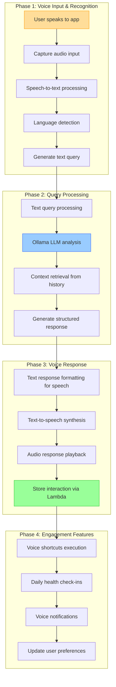
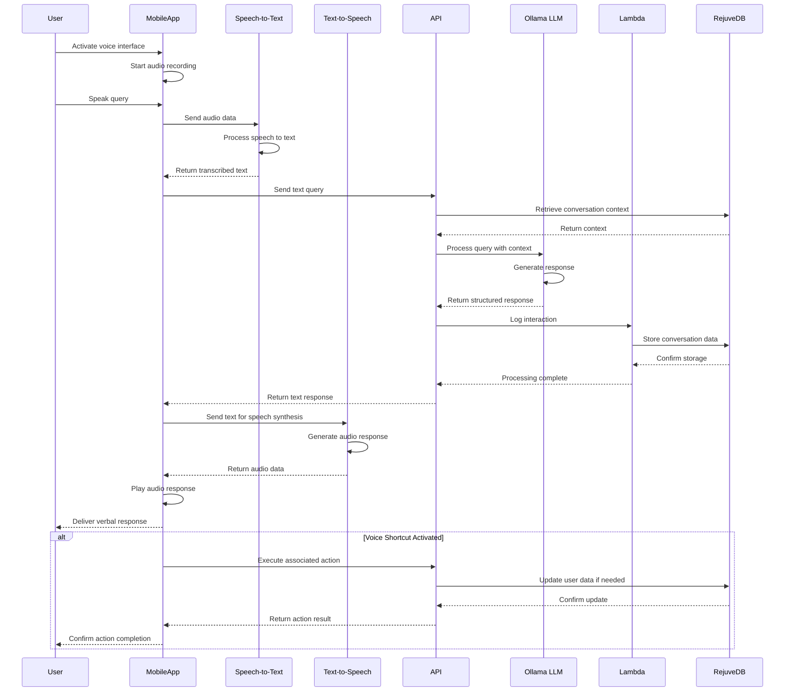

### Epic: **User Experience Enhancements — Talk to the APP**

---

#### Story Title

**Enable Voice Interaction with the Longevity App**

*Version: 0.2 | Date: 2025-06-09 | Created by: Persival Ballesté*

---

#### Story Overview

As a **Longevity App user**,  
I **want to interact with the app using my voice and hear spoken responses**,  
so that I can access my health data and app features hands-free and in a more natural, conversational manner.

---

#### Implementation Alternatives

| Approach | Description | Pros | Cons | Timeline |
| --- | --- | --- | --- | --- |
| **Alternative 1: Native Speech Processing** | Implement speech recognition and synthesis directly in the mobile app using on-device capabilities | • Better privacy (voice processing happens on-device) • Works offline • Lower latency for simple commands • No API usage costs | • Limited recognition accuracy • Larger app package size • Inconsistent performance across devices • Limited language support | ?weeks |
| **Alternative 2: Cloud-Based Speech Services** | Leverage specialized cloud services for speech recognition and synthesis | • Higher accuracy speech recognition • More natural sounding voices • Better multilingual support • Consistent performance • Lower device resource usage | • Requires internet connectivity • Potential privacy concerns • API usage costs • Higher latency | ?weeks |

**Recommended Approach:** A hybrid model that combines both alternatives - using on-device processing for simple commands and voice shortcuts for responsiveness and offline functionality, while leveraging cloud services for complex queries and conversations that require the Ollama LLM integration.

>> We'll implement voice activation and simple command recognition on-device, but route complex queries and conversations through our secure cloud infrastructure to leverage the Ollama LLM capabilities.

---

#### Functional Scope

|Phase|Capability|Summary|
|---|---|---|
|**1. Voice Input & Recognition**|• Implement **multilingual speech-to-text** capabilities. • Design voice activation and input UI elements. • Create error handling for unclear speech or noisy environments.|Enables users to speak to the app|
|**2. Voice Response System**|• Integrate text-to-speech capabilities in multiple languages. • Develop natural-sounding voice responses. • Create voice response settings and controls.|Allows the app to respond verbally to user input|
|**3. Conversational Intelligence**|• Connect voice interactions with Ollama-hosted LLM system. • Develop specialized prompts for audio conversations. • Create contextual awareness across conversation sessions.|Powers intelligent understanding and responses|
|**4. Voice Engagement Features**|• Implement daily voice check-ins and reminders via Lambda service. • Create voice-activated shortcuts for common tasks. • Build voice notification preferences stored in RejuveDB.|Extends usefulness beyond basic Q&A|

#### Acceptance Criteria

1. **Voice Recognition Performance**
    - System accurately transcribes speech in all supported languages with ≥90% accuracy in normal environments.
    - Voice recognition functions across both iOS and Android devices.
    - System handles various accents and speaking styles within supported languages.
        
2. **Speech Output Quality**
    - Text-to-speech output sounds natural and uses proper pronunciation for health and medical terms.
    - Voice responses maintain appropriate pacing and intonation.
    - Output volume adapts to ambient noise levels.
        
3. **Conversation Intelligence**
    - System understands context from previous statements in the same session.
    - Voice interactions successfully connect to appropriate app functionality.
    - Responses are concise and appropriate for audio format (avoiding lengthy explanations better suited to text).
        
4. **Multilingual Support**
    - Voice interaction works in all languages supported by the app.
    - System correctly detects the spoken language and responds in the same language.
    - Accent variations within a language are handled appropriately.
        
5. **Usability & Accessibility**
    - Voice interaction can be initiated with minimal steps.
    - System provides visual feedback during voice processing.
    - All voice features are accessible to users with disabilities through appropriate alternatives.
        
6. **Privacy & User Control**
    - Audio processing respects user privacy settings.
    - Users can review and delete their voice interaction history.
    - Users can customize voice engagement settings (voice type, frequency of suggestions, etc.).

---

#### Implementation Tasks (high-level)

- **Front-End (Flutter)**
    
    - Design and implement microphone access UI with appropriate permission flows.
        
    - Create animated voice activity indicators and feedback.
        
    - Build voice settings and controls interface.
        
    - Implement voice playback controls and volume management.
        
- **Voice Processing**
    
    - Evaluate and integrate multilingual speech-to-text models (open source or API-based).
        
    - Implement text-to-speech capabilities with natural-sounding voices.
        
    - Develop language detection for multilingual support.
        
    - Create noise filtering and speech enhancement processing.
        
- **Backend & API**
    
    - Develop `/voice/transcribe` endpoint for speech-to-text processing.
        
    - Create `/voice/synthesize` endpoint for text-to-speech generation.
        
    - Build voice session management service for conversation persistence.
        
    - Implement logging and analytics for voice interactions.
        
- **LLM Integration**
    
    - Develop specialized system prompts for voice interactions.
        
    - Create context management for conversational continuity.
        
    - Implement response optimization for audio delivery.
        
- **User Engagement**
    
    - Design voice-activated daily check-ins and health reminders.
        
    - Create voice notification system with customization options.
        
    - Develop voice shortcuts for common app actions.
        

---

#### Dependencies & Risks

|Item|Impact|Mitigation|
|---|---|---|
|Speech recognition accuracy|High|Select high-quality STT models; implement confidence scoring and clarification requests|
|Voice processing latency|Medium|Optimize model size vs. accuracy; consider hybrid local/cloud approach|
|User privacy concerns|High|Clear consent flows; local processing where possible; transparent data policies|
|Battery consumption|Medium|Optimize processing; implement power-aware activation modes|
|Ambient noise interference|Medium|Implement noise cancellation; provide visual feedback on audio quality|

---

#### Non-Functional Requirements

- **Performance**: Voice recognition response time must be under 1.5 seconds for standard queries.
    
- **Privacy**: Voice data must be processed according to GDPR/HIPAA requirements with clear user consent.
    
- **Reliability**: Voice features must function in various environments with different background noise levels.
    
- **Accessibility**: Voice interaction must comply with WCAG 2.1 guidelines for accessibility.
    
- **Battery Efficiency**: Voice features should not increase battery consumption by more than 15% during active use.

---

#### Definition of Done

- Voice input and output functions correctly across all supported devices and languages.
    
- Speech recognition accuracy meets or exceeds 90% in normal environments and 75% in challenging environments.
    
- Voice interaction successfully integrates with existing app functionality and LLM capabilities.
    
- User testing confirms positive experience across different user segments and use cases.
    
- Privacy controls and data processing comply with all applicable regulations.
    
- Performance metrics (latency, battery usage) meet or exceed targets.
    
- Voice accessibility features properly support users with disabilities.

---

#### Use of Reusable Services

This story leverages several reusable services and components that are shared across multiple features in Epic 1, promoting code reuse and architectural consistency:

1. **Ollama-hosted LLM Service**
   - Shared LLM instance for natural language understanding and response generation
   - Specialized prompts for voice-optimized responses
   - Context management for conversational continuity across sessions
   - Integration with health domain knowledge for accurate responses
   - Handling of multilingual queries and responses in coordination with translation services

2. **Lambda Data Processing Service**
   - Middleware between voice interaction system and RejuveDB
   - Processing and logging of voice interactions for analytics
   - Execution of voice shortcuts and commands
   - Management of voice notification preferences and scheduling
   - Standardized schema for voice interaction history

3. **RejuveDB Integration**
   - Storage of user voice preferences (voice type, speed, volume)
   - Conversation history and context retention
   - Voice shortcut configurations and personalization
   - Metrics and analytics for voice interaction quality
   - Cross-referencing between voice and text-based interactions

4. **Secure Audio Processing Pipeline**
   - Privacy-preserving speech recognition and synthesis
   - Secure transfer and temporary storage of audio data
   - On-device processing for sensitive commands where possible
   - User consent and control over voice data retention
   - HIPAA-compliant handling of health information in voice format

---

#### Process Flow Visualization

**Chart Explanation:**

This workflow illustrates the four key phases of the voice interaction system:

1. **Voice Input Phase**: The user speaks to the app, which captures audio, converts it to text using speech recognition, detects the language, and generates a text query.

2. **Query Processing Phase**: The text query is processed by the Ollama-hosted LLM, which retrieves relevant context from conversation history and generates a structured response.

3. **Voice Response Phase**: The text response is formatted specifically for speech, converted to audio using text-to-speech synthesis, played back to the user, and the interaction is stored via the Lambda service.

4. **Engagement Features Phase**: The system enables voice shortcuts, daily health check-ins, voice notifications, and updates user preferences based on interactions.

#### System Sequence Diagram

**Sequence Diagram Explanation:**

This sequence diagram illustrates the flow of voice interactions within the app:

1. **Voice Input**: The user activates the voice interface and speaks a query, which is recorded by the app and sent to the Speech-to-Text service for transcription.

2. **Query Processing**: The transcribed text is sent to the API, which retrieves relevant conversation context from RejuveDB and forwards both to the Ollama-hosted LLM for processing.

3. **Response Generation**: The LLM generates a structured response, which is logged via the Lambda service to RejuveDB for future context and analytics.

4. **Voice Output**: The text response is sent to the Text-to-Speech service for conversion to audio, which is then played back to the user.

5. **Action Execution**: If the user's query activates a voice shortcut, the associated action is executed, potentially updating user data in RejuveDB, and confirmation is provided to the user.
